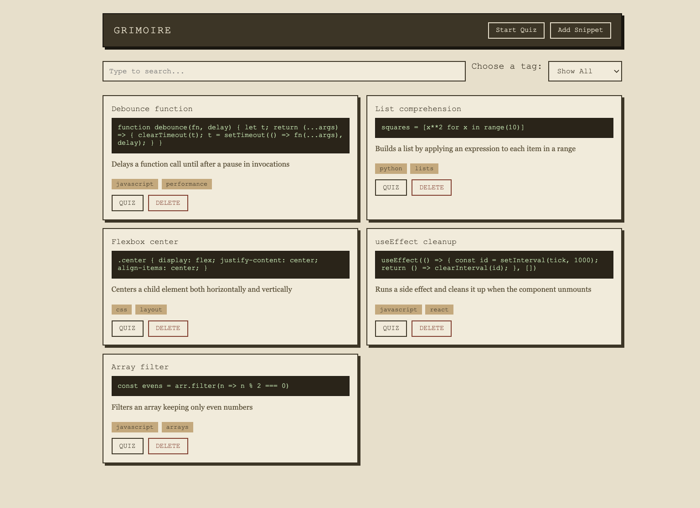
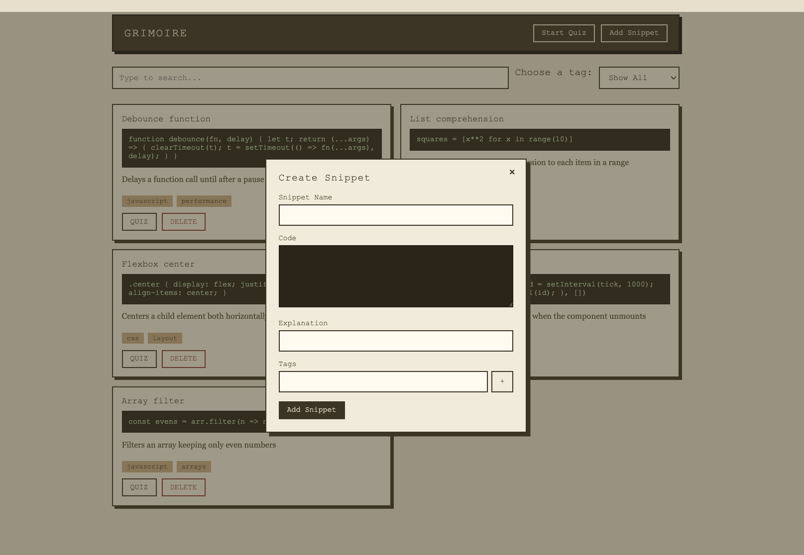
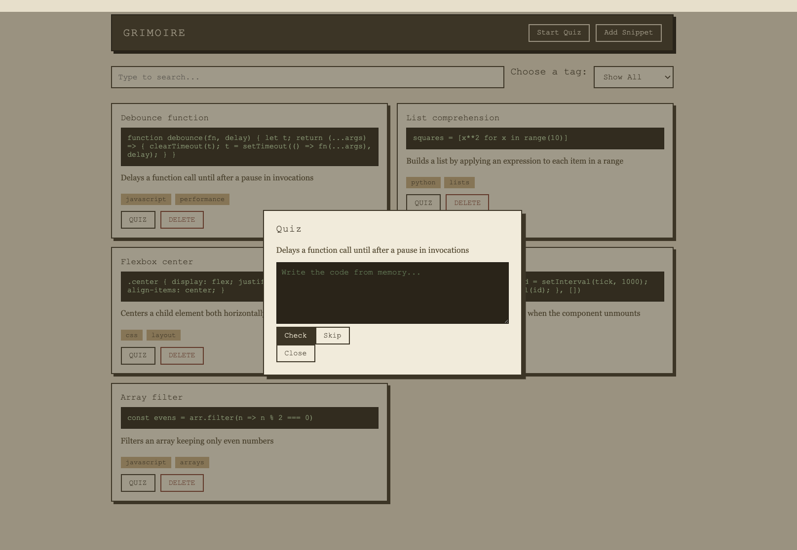

# Grimoire

A personal code snippet manager with built-in quizzing. Save snippets with your own explanation, tag them, search them, and test yourself on them later — either one at a time or in a full session loop across your whole collection. An AI judge (Ollama, running locally) checks whether your recreated code does the same thing as the original.

## Concept

- Every snippet requires an explanation in your own words, not just the code.
- Quiz mode hides the code and shows only the explanation. You write the code from memory, then check it.
- Checking doesn't lock you out — you can keep editing and re-check as many times as you want before revealing the original.
- Session mode cycles through your snippets (respecting whatever search/tag filter is active), one quiz after another.


## Screenshots




*Adding a new snippet with explanation and tags*


*Single-snippet quiz — explanation shown, code hidden until checked*

## Tech stack

**Backend** — Node.js, Express, SQLite (`better-sqlite3`)
**Frontend** — React (Vite)
**AI evaluation** — [Ollama](https://ollama.com), running locally, used to judge whether a recreated snippet is functionally equivalent to the original

## Project structure

```
grimoire/
  back/
    routes/
      snippets.js     # CRUD for snippets + tags
      quiz.js          # POST /api/quiz/:id — Ollama-backed correctness check
      index.js
    db.js              # SQLite connection, runs schema.sql on startup
    schema.sql         # snippets / tags / snippet_tags tables
    server.js
  front/
    src/
      components/
        Header.jsx
        FilterBar.jsx
        SnippetList.jsx
        SnippetCard.jsx
        AddSnippetModal.jsx
        QuizModal.jsx
        QuizSession.jsx
      hooks/
        useSnippets.js
      App.jsx
      main.jsx
      index.css
```

## Data model

Three tables, normalized many-to-many between snippets and tags:

```sql
snippets (id, name, code, explanation, created_at)
tags (id, name)
snippet_tags (snippet_id, tag_id)  -- join table
```

## Setup

### Prerequisites

- Node.js
- [Ollama](https://ollama.com) installed and running locally
- A model pulled for evaluation — this project is tuned for `llama3.2` (small, fast, good enough for a structured correctness judgment). `mistral` also works if you want a larger model, at the cost of slower responses.

```bash
ollama pull llama3.2
ollama serve
```

### Backend

```bash
cd back
npm install
node server.js
```

Runs on `http://localhost:3000`. The database file (`snippets.db`) and schema are created automatically on first run.

### Frontend

```bash
cd front
npm install
npm run dev
```

Runs on `http://localhost:5173` (Vite default).

## API

| Method | Route | Description |
|---|---|---|
| `GET` | `/api/snippets` | All snippets, with tags grouped per snippet |
| `POST` | `/api/snippets` | Create a snippet — `{ name, code, explanation, tags: [] }` |
| `DELETE` | `/api/snippets/:id` | Delete a snippet (cascades to `snippet_tags`) |
| `POST` | `/api/quiz/:id` | Evaluate a recreation attempt — `{ attempt }` → `{ match, hint }` |

## Usage tips

- Add a snippet with a real explanation — not a restatement of the code, but what problem it solves and why you'd reach for it.
- Use the single "QUIZ" button on a card to test yourself on just that one snippet.
- Use "Start Quiz" in the header to run a session across everything currently visible — filter by tag or search first if you want to focus on one topic.
- "Skip" moves on without attempting. "Next" only appears after you've checked at least once.
- "Reveal" is separate from checking — you can see the verdict without spoiling the original code if you want another attempt first.

## Status

Core features are complete: full CRUD, search + tag filtering, single-snippet and session-based quiz mode, AI-backed evaluation, and a pixel/beige visual theme.